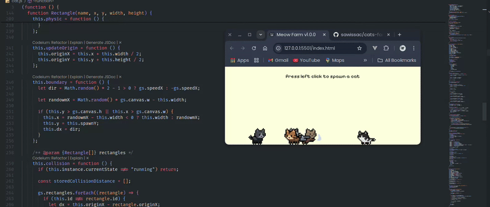

# Lovely Cat Farm.

Interactable canvas cats farm. This app is for dev who is bored and want to waste time on you free time. Accepts pr 😂

No cap, this project is a whole mood. No frameworks needed, just a genius building their own tomb. It's a vibe, a movement, a masterpiece. Period

View Site: [https://sawissac.github.io/catsfarm.github.io/](https://sawissac.github.io/catsfarm.github.io/)

# What will you learn from this repo.

* physic
* canvas
* boundary
* origin
* position
* reverse position calculation
* frame generation for sprite
* performance optimization for images
* collision
* distance calculation

Shout out to [Ekaterina Prozhirko](https://github.com/exsecantb/pixel-cat), I **appreciate** her art assets. No cap fr fr.
